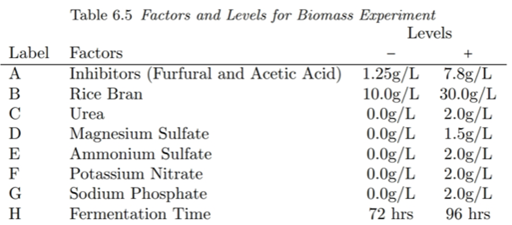
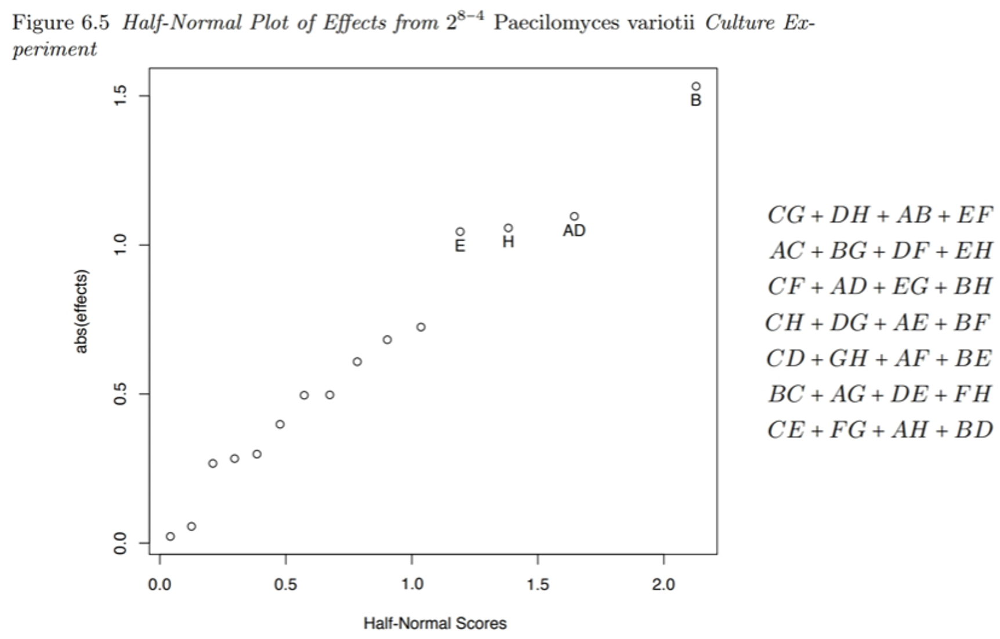

```{r setup, include=FALSE}
knitr::opts_chunk$set(echo = FALSE)
library(DoE.base)
```

## Review

* A full factorial design with $k$ factors requires $2^k$ runs.

* A half factorial design uses only $2^{k-1}$ runs.
  * Begin with a base design.
  * Set the remaining factor equal to an interaction (generator, $E=AB$)
  * Compute the defining relation ($I = \ldots$) and confounding/alias structure.

\pause
* Today we define quarter- or eighth-factorial designs!

## Quarter factorial ($2^{k-2}$) designs

Let's create a $2^{5-2}$ design (8 runs, factors $ABCDE$).

\pause
Start with a base $2^3$ design (factors $ABC$).

\pause
Define $D=AB$ and $E=AC$.
\[ D^2 = I = ABD,\quad		E^2 = I = ACE \]

\pause
Also, $I^2 = I = (ABD)(ACE) = BCDE$.

\pause
**Defining relation:** $I = ABD = ACE = BCDE$

## Confounding in our $2^{5-2}$ design

**Defining relation:** $I = ABD = ACE = BCDE$
\[ A(I) = A(ABD) = A(ACE) = A(BCDE) \]
\pause
\[ A + BD + CE + ABCDE \]
\pause
\[ B + AD + ABCE + CDE \]
\[ C + ABCD + AE + BDE \]
\[ D + AB + ACDE + BCE \]
\[ E + ABDE + AC + BCD \]
\pause
\[ BC + ACD + ABE + DE \]
\[ BE + ADE + ABC + CD \]

## Eighth fractional design: $2^{6-3}$

Factors $A$, $B$, $C$, $D=AB$, $E=AC$, $F=BC$
\pause
\[ I = ABD = ACE = BCF \]
\pause
Also, all combinations:
\begin{align*}
  I^2 &= I = (ABD)(ACE) = BCDE \\
  I^2 &= I = (ABD)(BCF) = ACDF \\
  I^2 &= I = (ACE)(BCF) = ABEF \\
  I^3 &= I = (ABD)(ACE)(BCF) = DEF
\end{align*}

**Defining relation:**
\[ I = ABD = ACE = BCF = BCDE = ACDF = ABEF = DEF \]

## Which generator should I choose?

A generator’s optimality is assessed with three criteria:

* **Resolution:** difference in the level of confounding.

* **Aberration:** the multiplicity of the worst confounding.

* **Clarity:** # of confounded main effects or two-way interactions.

## Criterion #1: Design Resolution

The resolution of a fractional design is the length of the shortest word in the defining relation.


\newcommand\iii{\ensuremath{\mathrm{III}}}
\newcommand\iv{\ensuremath{\mathrm{IV}}}

For the $2^{5-2}$ design generated by D=AB and E=AC, the definig relation is	
\[ I = ABD = ACE = BCDE \]
This is a Resolution \iii\ design. (Resolution is written with Roman numerals.)

## Resolution measures the degree of confounding

A resolution $R$ design has no $i$-level interaction aliased with effects lower than $R-i$.

\pause
Resolution \iii\

* Main effects ($i=1$) are confounded with secondary ($3-1 = 2$) interactions.

\pause
Resolution \iv\

* Main effects ($i=1$) are confounded with tertiary ($4-1 = 3$) interactions.

* TWIs ($i=2$) are confounded with other TWIs ($4-2 = 2$).

## Resolution and nested factorial designs

A design with resolution $R$ contains a full factorial design for  any subset of $k = R-1$ factors.

\pause
\medskip
If after the fractional experiments you drop to $k$ factors you can re-analyze the data for all the interactions.

## Criterion #2: Design Aberration

* **Resolution:** Length of the shortest word in the defining relation.

* **Aberration:** Number of words with length equal to the resolution.

\pause
\medskip
\begin{center}
$I = ABCDF = ABCEG = DEFG\quad$	resolution \iv, aberration 1

$I = ABCF = ADEG = BCDEFG\quad$	resolution \iv, aberration 2
\end{center}

\pause
\medskip
We favor the design with the lower aberration. It will have fewer main effects confounded with low-order interactions.

## Criterion #3: Clear Effects

A main effect or two-way interaction effect is **clear** if it is only confounded with higher order terms (three-way or higher).

\pause
\medskip
Clear effects always lead to tradeoffs. For a $2^{6-2}$ design:
\begin{align*}
  I &= ABCE = ABDF = CDEF &\quad	\text{6 main effects clear} \\
  I &= ABE = ACDF = BCDEF &\quad 	\text{3 main effects $+$ 6 TWIs clear} 
\end{align*}

## Overall design guidelines

1. Choose the highest **resolution** that fits your budget.
2. For that resolution, choose the **minimum aberration** design.
3. If you have particular effects that you know are signficant, try to choose a factor or generator that clears them.

## Example: Biomass optimization of *P. variotii*



## Design: $2^{8-4}$, 16 runs, no replicates

* Generators: $E = BCD$, $F = ACD$, $G = ABC$, $H = ABD$

* Resolution \iv, minimum aberration

* All main effects clear

* TWI confounding:
\[ CG+DH+AB+EF \]
\[ AC+BG+DF+EH \]
\[ CF+AD+EG+BH \]
\[ CH+DG+AE+BF \]
\[ CD+GH+AF+BE \]
\[ BC+AG+DE+FH \]
\[ CE+FG+AH+BD \]

## Setting up the design with the `FrF2` package
```{r echo=TRUE}
culture <- FrF2::FrF2(16, 
                      generators=c("BCD","ACD","ABC","ABD"), 
                      randomize=FALSE)
y <- c(5.75, 6.7, 11.12, 10.67, 4.92, 5.35, 2.81, 10.83, 
       6.08, 7.27, 9.68, 4.2, 3.9, 3.78, 11.57, 7.39)
culture <- DoE.base::add.response(culture, y)
```

## 
```{r}
culture
```

## 
```{r echo=FALSE}
model <- lm( y ~ (.)^2, data=culture )
summary(model)
```

## Aren't we short on degrees of freedom?

We only have 16 runs, so R estimates 1 intercept, 8 main effects, and 7 TWIs ($AB$ through $AH$).

Not only do we have no DoF left for confidence intervals, we only estimated $7/28$ TWIs!

\pause
Or did we...
\[ CG+DH+AB+EF \]
\[ AC+BG+DF+EH \]
\[ CF+AD+EG+BH \]
\[ CH+DG+AE+BF \]
\[ CD+GH+AF+BE \]
\[ BC+AG+DE+FH \]
\[ CE+FG+AH+BD \]

## But we don't have DoF to estimate confidence intervals

True, but there's still something we can do. 

* All factor levels are coded to units $-1$ and $+1$. Thus the effect sizes are directly comparable.
* We can assume the *practical significance* of an effect is proportional to its magnitude.

\pause
\medskip
We can also estimate statistical signficance.

* Assume that all the effect sizes in the model are normally distributed with mean zero.
* The $z$-score of the effect sizes can be compared with a standard normal to find a $p$-value.

```{r include=FALSE}
cfs <- coef(model)[2:16]
labels <- names(cfs)
daewr::halfnorm(cfs, nms, alpha=0.25, refline=FALSE)
```

## Half-normal plot



## Using half-normal plots

* Assumes the variables are coded so the effects sizes can be compared directly.

* Provides a ranked list of factors based on *practical significance*.

* Assuming normality of effect sizes allows estimation of *statistical significance* using $z$-scores.

* Great for screening designs; practically insignificant factors are dropped for a follow-up design with replicates or higher resolution.

## Take-home problem

At the beginning of the lecture we described a $2^{5-2}$ design with generators $D=AB$ and $E=AC$.
The defining relation was $I = ABD = ACE = BCDE$.

**Problem:** Construct a $2^{5-2}$ design using the generators $D=ABC$ and $E=AB$.

* Compute the defining relation for your design.
* What is the resolution and aberration? How does this compare to the design from the lecture?
* Compute the confounding relations for all five main effects.
