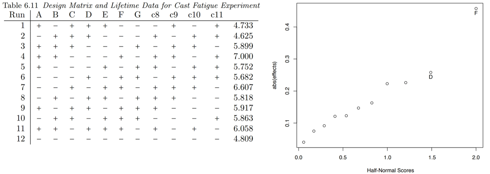

```{r setup, include=FALSE}
knitr::opts_chunk$set(echo = FALSE)
library(magrittr)
```

## Why do we use screening designs?

\newcommand\lo{\ensuremath{\boldsymbol{-}}}
\newcommand\hi{\ensuremath{\boldsymbol{+}}}
\newcommand\iii{\ensuremath{\mathrm{III}}}
\newcommand\iv{\ensuremath{\mathrm{IV}}}
\newcommand\vv{\ensuremath{\mathrm{V}}}

* Optimization is expensive---many runs/factor at $>2$ levels
* Too many factors waste resources
* Too few factors lead to suboptimal results

\pause
* **Solution:** A *screening design* tests a large number of factors
* Only active factors are carried forward for optimization

## What is a screening design?

* Screening designs have few runs, ideally $\le 2$ runs/factor.
\pause
* The focus is on main effects. By the Effect Hierarchy and Effect Heredity principles,
\[ \text{important factor} \approx \text{significant main effect} \]

\pause
* We don't worry about estimates of TWIs. We're selecting factors, not interactions.

## Types of screening designs

* Resolution \iii\ Fractional Factorial Design
  * Pro: Mirror image can clear main effects
  * Con: Run size always a power of 2

\pause
* PB Design
  * Pro: Run size in multiples of 4
  * Con: Complex aliasing

\pause
* Definitive Screening Designs
  * Hybrid screening/optimization design. We'll discuss later!


```{r include=FALSE}

#fctrs <- c(2^(3:7)-1, 2^(3:7), 2^(3:7)+1, 80, 81, 159, 160)
fctrs <- c(7,8,9, 15,16,17, 31,32,33, 63,64,65, 80,81, 127)

designs <- expand.grid(factors=fctrs, resolution=3:4)
designs$runs <- 0
for (i in 1:nrow(designs)) {
  designs$runs[i] <- nrow(FrF2::FrF2(nfactors=designs$factors[i], resolution=designs$resolution[i]))
}

designs %<>%
  dplyr::mutate(resolution = ifelse(is.na(resolution), "full", as.character(resolution))) %>%
  dplyr::mutate(resolution = factor(resolution, levels=c("4", "3")))

levels(designs$resolution) <- c("IV", "III")
```

## Don't rule out Fractional Factorial Designs.

```{r out.width='75%', fig.align='center'}
ggplot2::qplot(data=designs, 
               x=factors, y=runs, 
               color=resolution, 
               geom=c("line")) +
  ggplot2::theme_classic(base_size=36)
```

##
\begin{columns}

\begin{column}{0.8\textwidth}
\begin{center}
\includegraphics[width=\textwidth]{figures/frf2-resolution.png}
\end{center}
\end{column}

\begin{column}{0.2\textwidth}
{\footnotesize Gromping, 2014\\ \emph{J.\ Stat.\ Software}}
\end{column}

\end{columns}

## Workflow for Resolution \iii\ screens

1. Run the design
2. Fit the model with main effects. If you have DoF left over, add any TWIs that are **not** confounded with main effects.
3. If the overall model fit is bad, or if you expected certain effects to be significant that were not, consider a second batch of runs with a mirror image design.
4. Drop any factors that are not **important** (practically or statistically).

## Plackett-Burman Designs

* Discovered in 1946 while working in the British Ministry of Supply
* Orthogonal designs, so main effects can be estimated independently
* Run sizes in **multiples of 4**

\pause
* Both PB designs and FF designs are *Orthogonal Arrays*
  * PB = FF when $N=2^k$

\pause
* PB designs have *complex aliasing*. Every ME is partially confounded with all TWIs.

## Creating a PB design (up to 23 factors)

1. Start with the first run from the following table.

\medskip
\begin{center}
\begin{tabular}{cl}
Runs & Factor Levels \\
\hline
12 & \hi\,\hi\,\lo\,\hi\,\hi\,\hi\,\lo\,\lo\,\lo\,\hi\,\lo \\
20 & \hi\,\hi\,\lo\,\lo\,\hi\,\hi\,\hi\,\hi\,\lo\,\hi\,\lo\,\hi\,\lo\,\lo\,\lo\,\lo\,\hi\,\hi\,\lo \\
24 & \hi\,\hi\,\hi\,\hi\,\hi\,\lo\,\hi\,\lo\,\hi\,\hi\,\lo\,\lo\,\hi\,\hi\,\lo\,\lo\,\hi\,\lo\,\hi\,\lo\,\lo\,\lo\,\lo 
\end{tabular}
\end{center}
\medskip

2. Cycle the factor levels by one to get run #2. Repeat for 11, 19, or 23 runs.

3. Set the final run to all low (\lo).

4. If the number of factors $k$ is less than the number of runs, select the first $k$ columns.

## Workflow for PB designs

1. Run the design.
2. Fit a model with main effects plus an effect for any unused column in the design.
3. Optional: Perform subset regression to identify factors that appear frequently in smaller models with good predictive power.
4. Drop any factors that are not **important** (practically or statistically).
5. If only a small number of factors remain, try refitting the small model.


## Example PB design: Cast fatigue



This design includes 7 factors; however, effects are estimated for all columns. The last 4 "factors" are interactions with complex aliasing.

## To replicate or not to replicate?

* Many screening designs are *saturated* --- there are no DoF to estimate confidence intervals for the parameters.
* The number of estimable factors is bounded by the rank of the model matrix. Replicates do not changes the rank.
* If you don't replicate the design, you can select factors based on the magnitude of the effects alone (half-normal plot).
  * Remember that half-normal plots work better as the number of factors grows.
  
\pause
* Replicating a Resolution \iii\ Design
  * Consider a mirror-image instead. This will give clear main effects.
  * Check if you can afford a Resolution \iv\ instead. This gives clear main effects and a confounding structure.
  
* Replicating a PB Design
  * Replicating the design will help you estimate the "pure error".
  * You can "move up" to a larger PB design to get extra runs. This won't estimate pure error, but you can add more confounded effects to the model to improve the estimates.


