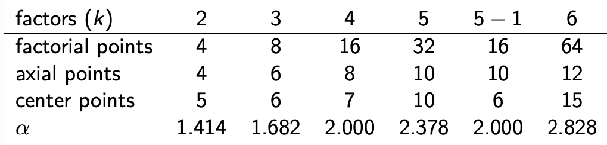

```{r}
library(rsm)
library(daewr)
```

Data from Table 10.3:

Box-Behnken designs with `bbd`

```{r}
treb <- bbd(distance ~ x1 + x2 + x3, 
            n0 = 3,
            randomize=FALSE,
            coding=list(x1 ~ (armlen-6)/2, 
                        x2 ~ (counter-15)/5, 
                        x3 ~ (missile-2.5)/0.5))
treb
```

Adding the response data.

```{r}
treb$distance <- c(33, 85, 86, 113, 75, 105, 40, 89, 83, 108, 49, 101, 88, 91, 91)
treb
```

Setting up a CCD with `ccd`



```{r}
ccd(y ~ x1 + x2, generator=x3 ~ x1*x2, n0=c(3,2), 
    alpha="orthogonal", randomize=FALSE)
```

Example: Optimizing the yield of a chemical reaction by varying
the reaction time and temperature.

Time varies from 80 - 90 [units?] (-1 to 1)
Temp varies from 170 - 180 [units?] (-1 to 1)

```{r}
react <- ccd(Yield ~ x1 + x2,
             n0 = c(3,3),
             randomize=FALSE,
             coding = list(x1 ~ (Time - 85)/5,
                           x2 ~ (Temp - 175)/5))
react
```

```{r}
react$Yield <- c(80.5, 82.0, 81.5, 83.5, 83.9, 84.3, 84.0,
                 75.6, 78.4, 77.0, 78.5, 79.7, 79.8, 79.5)
```

Fitting a FO+TWI model using the first 7 runs (FF + 3 CPs)
```{r}
FOreact <- rsm(Yield ~ FO(x1,x2)+TWI(x1,x2), data=react, subset=1:7)
summary(FOreact)
```

```{r}
react
SOreact <- rsm(Yield ~ Block + SO(x1,x2), data=react)
summary(SOreact)
```


