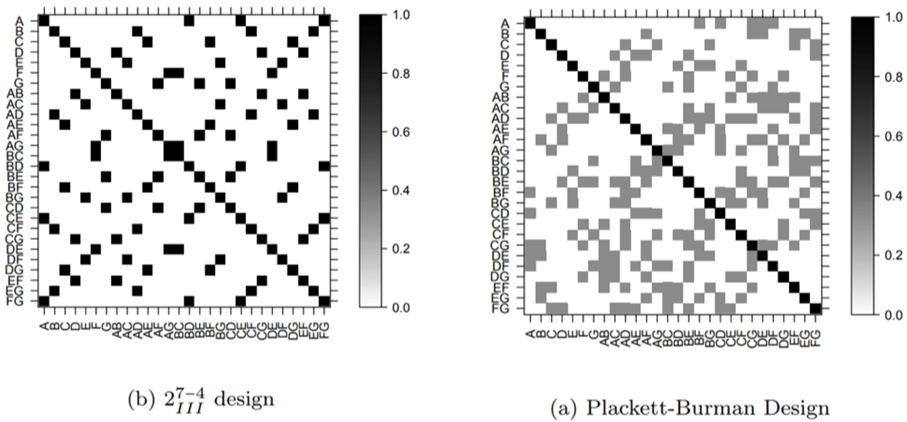
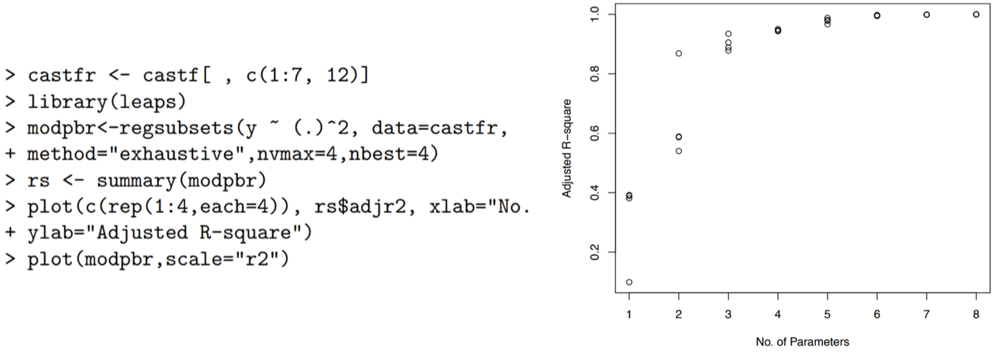
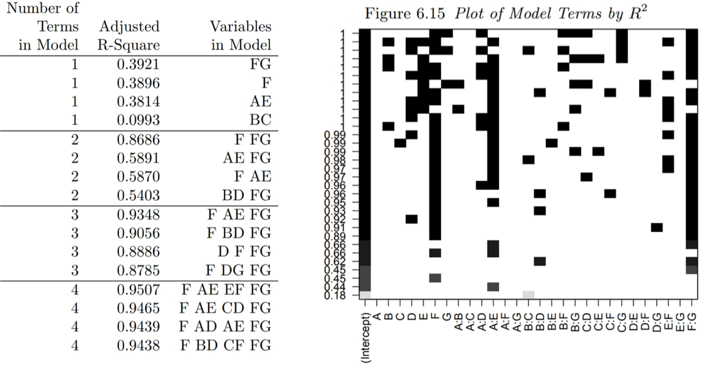

```{r setup, include=FALSE}
knitr::opts_chunk$set(echo = FALSE)
library(magrittr)
```

## How low can we go?

\newcommand\lo{\ensuremath{\boldsymbol{-}}}
\newcommand\hi{\ensuremath{\boldsymbol{+}}}
\newcommand\iii{\ensuremath{\mathrm{III}}}
\newcommand\iv{\ensuremath{\mathrm{IV}}}

```{r include=FALSE}
designs <- tibble::tribble(
  ~factors, ~fraction, ~resolution,
  2, 0, NA,
  3, 0, NA,
  3, 1, 3,
  4, 0, NA,
  4, 1, 4,
  5, 0, NA,
  5, 1, 5,
  5, 2, 3,
  6, 0, NA,
  6, 1, 6,
  6, 2, 4,
  6, 3, 3,
  7, 0, NA,
  7, 1, 7,
  7, 2, 4,
  7, 3, 4,
  7, 4, 3,
  8, 0, NA,
  8, 1, 8,
  8, 2, 5,
  8, 3, 4,
  8, 4, 4,
  9, 0, NA,
  9, 1, 9,
  9, 2, 6,
  9, 3, 4,
  9, 4, 4,
  9, 5, 3,
  10, 0, NA,
  10, 1, 10,
  10, 2, 7,
  10, 3, 5,
  10, 4, 4,
  10, 5, 4,
  10, 6, 3
)

designs %<>%
  dplyr::group_by(factors, resolution) %>%
  dplyr::summarise(fraction = max(fraction)) %>%
  dplyr::ungroup() %>%
  dplyr::mutate(runs = 2^(factors - fraction)) %>%
  dplyr::filter(resolution <= 5 | is.na(resolution)) %>%
  dplyr::mutate(resolution = ifelse(is.na(resolution), "full", as.character(resolution))) %>%
  dplyr::mutate(resolution = factor(resolution, levels=c("full", "5", "4", "3")))
```

The efficiency of fractional factorial designs offsets the exponential increase in runs for factorial designs.

```{r out.width='75%', fig.align='center'}
ggplot2::qplot(data=designs, 
               x=factors, y=runs, 
               color=resolution, 
               geom=c("line", "point")) +
  ggplot2::theme_classic(base_size=36)
```

## How low can we go? (zoomed in)

```{r out.width='85%', fig.align='center'}
ggplot2::qplot(data=designs %>% dplyr::filter(runs < 150), 
               x=factors, y=runs, 
               color=resolution, 
               geom=c("line", "point"),
               ylim=c(0,150)) +
  ggplot2::theme_classic(base_size=36)
```

##
\begin{columns}

\begin{column}{0.8\textwidth}
\begin{center}
\includegraphics{figures/frf2-resolution.png}
\end{center}
\end{column}

\begin{column}{0.2\textwidth}
{\footnotesize Gromping, 2014\\ \emph{J.\ Stat.\ Software}}
\end{column}

\end{columns}

## Foldover Designs

\begin{columns}

\begin{column}{0.5\textwidth}
Imagine a $2^{6-3}_\iii$ design with 
\[ D=AB, \quad E=AC,\quad F=BC \]
\begin{align*}
  I &=ABD=ACE=BCF=DEF \\
  &=BCDE=ACDF=ABEF
\end{align*}

After analysis, we find that both $B$ and $D$ are significant.

\medskip
Since $D=AB$, the significance of $D$ might be due to $B$ and $AB$.

\medskip
We can \emph{augment} the design by doubling the runs \emph{with $D$ flipped}. This clears $D$ and its interactions.
\end{column}

\begin{column}{0.5\textwidth}
\begin{tabular}{ccccccc}
Run & $A$ & $B$ & $C$ & $D$ & $E$ & $F$ \\
\hline
1 & \lo & \lo & \lo & \hi & \hi & \hi \\
2 & \hi & \lo & \lo & \lo & \lo & \hi \\
3 & \lo & \hi & \lo & \lo & \hi & \lo \\
4 & \hi & \hi & \lo & \hi & \lo & \lo \\
5 & \lo & \lo & \hi & \hi & \lo & \lo \\
6 & \hi & \lo & \hi & \lo & \hi & \lo \\
7 & \lo & \hi & \hi & \lo & \lo & \hi \\
8 & \hi & \hi & \hi & \hi & \hi & \hi \\
\hline
\end{tabular}

\pause
\begin{tabular}{ccccccc}
 9 & \lo & \lo & \lo & \lo & \hi & \hi \\
10 & \hi & \lo & \lo & \hi & \lo & \hi \\
11 & \lo & \hi & \lo & \hi & \hi & \lo \\
12 & \hi & \hi & \lo & \lo & \lo & \lo \\
13 & \lo & \lo & \hi & \lo & \lo & \lo \\
14 & \hi & \lo & \hi & \hi & \hi & \lo \\
15 & \lo & \hi & \hi & \hi & \lo & \hi \\
16 & \hi & \hi & \hi & \lo & \hi & \hi \\
\hline
\phantom{Run} &  \\
\end{tabular}
\end{column}

\end{columns}

## Mirror image designs

If we combine a Resolution \iii\ design with its mirror image (all factors flipped), we have a Resolution \iv\ design with all main effects clear.

\medskip
If we add a blocking factor we can perform the experimental batches sequentially.

\medskip
As with foldover designs, mirror image designs are only necessary if more than one main effect is significant.

## Plackett-Burman (PB) Designs

The number of runs in a fractional factorial design is always a power of two (8, 16, 32, $\ldots$).

\medskip
Plackett-Burman designs allow run sizes in multiples of four regardless of the number of factors.

\medskip
PB designs have no generators or defining relation (pro & con).

## Creating a PB design (up to 23 factors)

1. Start with the first run from the following table.

\medskip
\begin{center}
\begin{tabular}{cl}
Runs & Factor Levels \\
\hline
12 & \hi\,\hi\,\lo\,\hi\,\hi\,\hi\,\lo\,\lo\,\lo\,\hi\,\lo \\
20 & \hi\,\hi\,\lo\,\lo\,\hi\,\hi\,\hi\,\hi\,\lo\,\hi\,\lo\,\hi\,\lo\,\lo\,\lo\,\lo\,\hi\,\hi\,\lo \\
24 & \hi\,\hi\,\hi\,\hi\,\hi\,\lo\,\hi\,\lo\,\hi\,\hi\,\lo\,\lo\,\hi\,\hi\,\lo\,\lo\,\hi\,\lo\,\hi\,\lo\,\lo\,\lo\,\lo 
\end{tabular}
\end{center}
\medskip

2. Cycle the factor levels by one to get run #2. Repeat for 11, 19, or 23 runs.

3. Set the final run to all low (\lo).

4. If the number of factors $k$ is less than the number of runs, select the first $k$ columns.

## A 12-run PB design
\begin{center}
\begin{tabular}{r|cccccccccccc}
Run & $A$ & $B$ & $C$ & $D$ & $E$ & $F$ & $G$ & $H$ & $J$ & $K$ & $L$ \\
\hline
1 & \hi & \hi & \lo & \hi & \hi & \hi & \lo & \lo & \lo & \hi & \lo \\
2 & \lo & \hi & \hi & \lo & \hi & \hi & \hi & \lo & \lo & \lo & \hi \\
3 & \hi & \lo & \hi & \hi & \lo & \hi & \hi & \hi & \lo & \lo & \lo \\
4 & \lo & \hi & \lo & \hi & \hi & \lo & \hi & \hi & \hi & \lo & \lo \\
5 & \lo & \lo & \hi & \lo & \hi & \hi & \lo & \hi & \hi & \hi & \lo \\
6 & \lo & \lo & \lo & \hi & \lo & \hi & \hi & \lo & \hi & \hi & \hi \\
7 & \hi & \lo & \lo & \lo & \hi & \lo & \hi & \hi & \lo & \hi & \hi \\
8 & \hi & \hi & \lo & \lo & \lo & \hi & \lo & \hi & \hi & \lo & \hi \\
9 & \hi & \hi & \hi & \lo & \lo & \lo & \hi & \lo & \hi & \hi & \lo \\
10 & \lo & \hi & \hi & \hi & \lo & \lo & \lo & \hi & \lo & \hi & \hi \\
11 & \hi & \lo & \hi & \hi & \hi & \lo & \lo & \lo & \hi & \lo & \hi \\
12 & \lo & \lo & \lo & \lo & \lo & \lo & \lo & \lo & \lo & \lo & \lo 
\end{tabular}
\end{center}

Note: We skip ``$I$'' when naming factors as this symbol is used for the intercept.

## Confounding in PB designs

* Factors in **FF** designs are *confounded* (perfectly correlated).
* Factors in **PB** designs are *partially correlated* (complex aliasing).



## Example PB design: Cast fatigue


This design includes 7 factors; however, effects are estimated for all columns. The last 4 ``factors'' are interactions with complex aliasing.

\medskip
\pause
The complex aliasing of PB designs allow us to fit models with main and TWI terms **provided the number of terms is small**. This feature is called the *hidden projection property*.

## What effects should I include?

Many small models can be built from the 7 main effects and `r choose(7,2)` TWIs. How many effects should I include, and which ones?

\medskip
\pause
We use *subset selection* to find good models with few terms.

\medskip

\pause
We stop adding effects when the model improvement diminishes.

Here 3 parameters is a good cutoff.

## What parameters should be selected?



\pause
Be mindful of the *heredity effect*: A model that includes an interaction should also include the corresponding main effects.

## Mixed-level factorials

* Fractional factorial and PB designs use two level factors (\hi/\lo).
* The theory does not extend simply to multi-level factors.

\pause
* One solution is Orthogonal Array Designs (OAs).
  * OAs are ``hand-crafted'' for mixtures of 2- and 3-level factors.
  * Software packages choose OA designs from catalogs.

\pause
* Analysis of OAs is similar to PB designs
  * Resolution \iii, no defining relation
  * Complex aliasing, hidden projection
  * Models with few parameters can be fit directly to the data.

## (Fractional) Factorial Summary

* Fractional designs are the **most** efficient method to screen large numbers of factors.
* Factors are confounded, but the alias structure is known.
* PB designs are an alternative if 
  1. a specific # of runs is needed, or 
  2. you don’t want a secondary experiment.
* Factors with >2 levels require OA designs.

