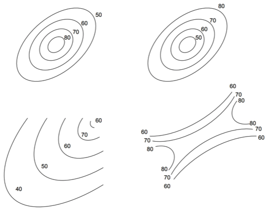
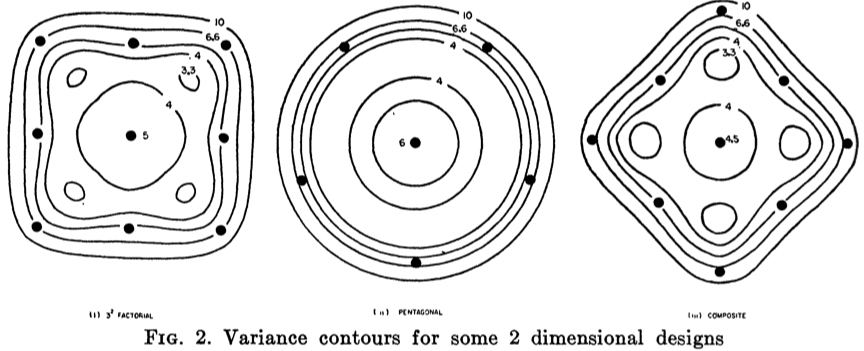
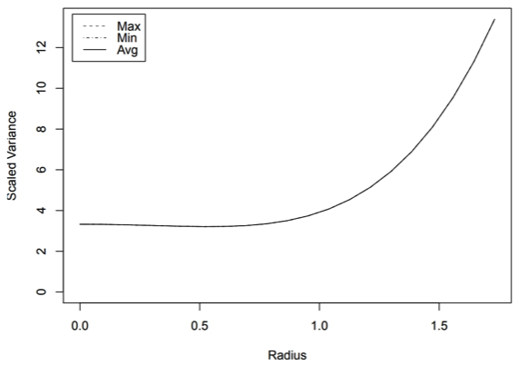

```{r setup, include=FALSE}
knitr::opts_chunk$set(echo = FALSE)
```

## Optimizing with Continuous Factors

- With *discrete* factors we can choose the optimal factor settings by examining the coefficients.
- With *continuous* factors the optimal factor settings are usually not among the levels tested in the experimental design.
- RSM uses numerical optimization to find the ideal factor settings.

## The Problem with First Order Models

Consider the simple first order (FO) model
\begin{align*}
  y &= \beta_1x_1 + \beta_2x_2 \\
    &= 2.3x_1 - 1.4x_2
\end{align*}

\pause
Neither component of the gradient of this function depends on the factor levels.
\begin{align*}
 \frac{\partial y}{\partial x_1} &= \beta_1 = 2.3 \\
 \frac{\partial y}{\partial x_2} &= \beta_2 = -1.4 
\end{align*}

\pause
Maximizing the response $y$ implies $x_1\rightarrow\infty$ and $x_2\rightarrow-\infty$.

## The Problem with Two-Way Interaction Models

Adding a two-way interaction (TWI) doesn't help.
\begin{align*}
 y &= \beta_1x_1 + \beta_2x_2 + \beta_{12}x_1x_2 \\
   &= 2.3x_1 - 1.4x_2 - 0.5x_1x_2
\end{align*}

\pause
\begin{align*}
  \frac{\partial y}{\partial x_1} &= \beta_1 + \beta_{12}x_2 \\
  &= 2.3 - 0.5x_2
\end{align*}

If $x_2 < 4.6$, then set $x_1 = \infty$. Otherwise, $x_1 = -\infty$.

## FO and TWI models are not realistic

No one believes that the response will increase indefinitely by increasing a factor with a positive effect. 

The diminishing returns we see in real life are not reflected by FO models since they lack *curvature*.

TWI models curve, but they do not diminish as the magnitude of each factor increases.

## Realistic models are nonlinear

The *true* model for any system is a general nonlinear function
\[ y = f(x_1, x_2, \ldots, x_k) \]

\pause
If you know $f$ for your system, congrats! Fit its parameters with regression and use it.

\pause
Usually we don't know $f$, so we approximate it with a simpler function. For RSM, a quadratic approximation is often sufficient.

\pause
We are not claiming that $f$ is quadratic. Rather, we claim that a second-order approximation is ``good enough" over our domain of interest.

## Surfaces that can be approximated with quadratics



## Approximating $f$ with a general quadratic

Let's find the second-order Taylor series of $f(x_1,x_2)$ centered at zero:

\begin{align*}
f(x_1,x_2) \approx&\, f\rvert_0 + \frac{\partial f}{\partial x_1}\bigg\rvert_0x_1 + \frac{\partial f}{\partial x_2}\bigg\rvert_0x_2
    + \frac{1}{2}\frac{\partial f}{\partial x_1\partial x_2}\bigg\rvert_0x_1x_2 \\ &+ \frac{1}{2}\frac{\partial^2 f}{\partial x_1^2}\bigg\rvert_0x_1^2 + \frac{1}{2}\frac{\partial^2 f}{\partial x_2^2}\bigg\rvert_0x_2^2
\end{align*}
\pause
\begin{align*}
\phantom{f(x_1,x_2)} \equiv&\, \beta_0 + \beta_1x_1 + \beta_2x_2 + \beta_{12}x_1x_2 + \beta_{11}x_1^2 + \beta_{22}x_2^2
\end{align*}

\pause
Since the function $f$ and its derivatives are unknown, we fit the parameters $\beta$ with a linear model.

## Approximating $f$ with a general quadratic (continued)

In general we will have $k$ factors and the quadratic approximation will be

\[ y = \beta_0 + \sum_{i=1}^k\beta_ix_i + \sum_{j=1}^k\sum_{i=1}^j\beta_{ij}x_ix_j + \sum_{i=1}^k\beta_{ii}x_i^2 \]

This model has $1 + k(k-1)/2 + k$ parameters, so response surface designs must have at least this many runs.

\pause
Additionally, we cannot use $2^k$ factorial (or fractional) designs since two levels for each factor **will not allow us to estimate curvature**. A $3^k$ factorial design would work, but a *central composite design* is better.

## The Central Composite Design (CCD)

```{r fig.align="center", out.width="67%"}
knitr::include_graphics("figures/ccd.png")
```

1. A $2^k$ factorial or a Resolution V $2^{k-p}$ fractional design allow estimation of the FO and TWI terms.
2. The axial points estimate the pure quadratic (PQ) terms.
3. Replicated center points estimate the model's precision.

## Uncertainty in the design space

Factorial models are most precise at the center of the design space.

The variance in the model's predictions increases as the *radius* (the distance from the center point) increases.
```{r fig.align="center", out.width="80%"}

```
\begin{center}\tiny{Image from Box and Hunter 1957.}\end{center}

## Uniform Precision in CCD

```{r fig.align="center", out.width="67%"}

```

A model has *uniform precision* if the variance at radius$=1$ is the same as the variance at the center.

Choosing the correct number of center points in a CCD ensures uniform precision.

## Correct number of center points (Box and Hunter 1957)

\begin{tabular}{lcccccccccccc}
  factors ($k$) & 2 & 3 & 4 & 5 & $5-1$ & 6 & \\
  \hline
  factorial points & 4 & 8 & 16 & 32 & 16 & 64 \\
  axial points & 4 & 6 & 8 & 10 & 10 & 12 \\
  center points & 5 & 6 & 7 & 10 & 6 & 15 \\
  $\alpha$ & 1.414 & 1.682 & 2.000 & 2.378 & 2.000 & 2.828
\end{tabular}

\begin{tabular}{lcccccccccccc}
  factors ($k$) & $6-1$ & 7 & $7-1$ & 8 & $8-1$ & $8-2$ \\
  \hline
  factorial points & 32 & 128 & 64 & 256 & 128 & 64 \\
  axial points & 12 & 14 & 14 & 16 & 16 & 16 \\
  center points & 9 & 21 & 14 & 28 & 20 & 13 \\
  $\alpha$ & 2.378 & 3.364 & 2.828 & 4.000 & 3.364 & 2.828
\end{tabular}

## Rotatable Designs

Ideally, the change in precision should be independent of the direction we move away from the center. Designs where the variance only depends on the radius are called *rotatable designs*.

\pause
Each factor in the CCD will be set at five levels:
\[ -\alpha\quad-1\quad\phantom{-}0\quad\phantom{-}1\quad\phantom{-}\alpha \]
We make a CCD rotatable by choosing $\alpha$, the distance to the axial points. If a design has $F$ factorial runs, we set
\[ \alpha = \sqrt[4]{F} \]

This means the coded units in a CCD have meaning!

## Coding the CCD

Let's say we're designing a combination screening of three drugs. The absolute widest concentration range we can use for drug A is $[-3.2, 1.0]$ on a $\log_{10}$-$\mu$M scale. What are the five levels assuming a full-factorial CCD?
\pause
\[ F = 2^3 = 8 \Rightarrow \alpha = \sqrt[4]{8} = 1.68 \]
\pause
\begin{align*}
\text{A} &= \text{center}(\text{A}) + \frac{\text{range}(\text{A})}{2\alpha}[\text{code}] \\
  &= -1.1 + \frac{1 - (-3.2)}{2(1.68)}[\text{code}]
\end{align*}

\pause
\begin{center}
\begin{tabular}{rccccc}
  code: & $-\alpha$ & $-1$ & $\phantom{-}0$ & $1$ & $\alpha$ \\
  $\log_{10}$-$\mu$M: & $-3.2$ & $-2.4$ & $-1.1$ & $0.2$ & $1.0$
\end{tabular}
\end{center}

